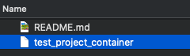
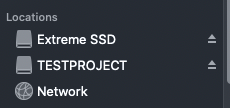
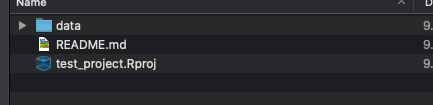

```{r setup, include=FALSE}
options(htmltools.dir.version = FALSE)
knitr::opts_chunk$set(
  fig.width=9, fig.height=3.5, fig.retina=3,
  out.width = "100%",
  cache = FALSE,
  echo = TRUE,
  message = FALSE, 
  warning = FALSE,
  fig.show = TRUE,
  hiline = TRUE
)
```

```{r xaringan-themer, include=FALSE, warning=FALSE}
library(xaringanthemer)
ca_blue <- "#3863a2"
ca_blue2 <- "#3c61aa"
ca_dark_blue <- "#2d3b5a"
ca_green <- "#96c342"
gray <- "#3c3c3b"
black <- "#000000"
style_duo_accent(
  primary_color = ca_blue,
  secondary_color = ca_green,
  header_color = ca_blue,
  text_color = gray,
  code_inline_color = colorspace::lighten(black),
  text_bold_color = colorspace::lighten(black),
  link_color = ca_blue,
  title_slide_text_color = "#FFFFFF",
  inverse_header_color = "#FFFFFF",
  text_font_size = "1.2rem",
  header_font_google = google_font("Roboto", "300"),
          text_font_google = google_font("Roboto"),
          code_font_google = google_font("Fira Mono")
)
```


## Our project infrastructure

- Communication
 

- **encryption**


- **data exchange**


---
## Data privacy agreement

- You should've received it (e.g. over Slack or Email), otherwise please see [here](https://correlcloud.org/index.php/s/7PSskX9yN7RKmoi?path=%2Ftemplate_data_privacy)
- the agreement defines scenarios that don't all have to apply to your project
  - everyone: confidentiality, data privacy
  - data security requirements can vary depending on type of processed data (personal data or not, confidential data or not)

---
class: middle, center, inverse 

# Data security and encryption

---

## Personal data 

personal data from a project must not be stored in an _unencrypted manner over a longer period of time_.

--

`r emo::ji("warning")` pseudonymised data (e.g. without names and email addresses) are still considered personal data most of the time. <sup>1</sup>

--

Exceptions: 

- synthetic ("fake") data: can be left unencrypted
- initial transfer via CorrelCloud: data are temporarily unencrypted (in your `Downloads` folder) -> encrypt/move as soon as possible 

.footnote[
[1] The GDPR has high requirements for the complete anonymization of data

]

---
## Encryption

**Options**: encrypted home folder or Veracrypt

| encrypted home folder                          | no encrypted home folder                    |
|---------------------------------------------------------|---------------------------------------------------------|
| VeraCrypt is not needed                           | VeraCrypt is needed                              |
| deletion of data after project | deletion of data after project |

---
## Encrypted home folder

- possible for:
    - Windows Pro and Enterprise -> unfortunatly not generally available for Home
    - _some_ Windows 10 Home devices: [Device Encryption](https://support.microsoft.com/en-gb/windows/device-encryption-in-windows-ad5dcf4b-dbe0-2331-228f-7925c2a3012d#ID0EBBD=Windows_10)
    - Mac OS from Mac-OS X 10.4: [FileVault](https://support.apple.com/en-us/HT204837)
    - most  Linux distributions<sup>1</sup>
- **The admin user of the machine needs to be password protected as well**

.footnote[
[1] for most distributions, it is not possible to enable encryption after setup. if your drive is not encrypted, please use veracrypt. 
]

---
class: middle, center, inverse

# 5 minute check, whether one of the built-in options is available for you 

---
## VeraCrypt
- encryption program and TrueCrypt successor
- a VeraCrypt container is a password-protected _file_ which can only be read by VeraCrypt after entering the password 
- VeraCrypt _mounts_ the file as a _drive_ in your operating system (after entering the password)
- This way, other programs can access the files in the container
- The drive is only available as long VeraCrypt is running

---
## VeraCrypt Workflow
.center[
]

.center[
**Container file**



`r emo::ji("arrow_down")`


`r emo::ji("arrow_down")`

**Container is mounted as a drive and files within it can be accessed**




]


---
## Creating a VeraCrypt container

- install [VeraCrypt](https://www.veracrypt.fr/en/Downloads.html) and start it

--

### Create a new container

- if not specified differently: confirm default settings
  - encrypted **file container** (not partition!)
- set name and location for file container (needs to be within the home folder)  -> **put the file where you'd normally put the project folder** (e.g. `home/frie/correlaid/projects/`)
- set the size of the file container  (1GB (1024 MB) should suffice)
- set the password: use a password which was created by your password manager<sup>1</sup> or use a  [passphrase](https://www.useapassphrase.com/) with at least 4 words

.footnote[
[1] e.g. [bitwarden](https://bitwarden.com) has a free plan.
]


---
## Mounting a VeraCrypt container
- select the container file 
- select one of the drive letters (windows) respectively slots (mac/linux)
- "dismount" once you are finished working on the project for today

---
class: inverse, center, middle

# What do we do with the container now?

---
## Disclaimer

We haven't excessively tested those scenarios and workflows in "the real life"

**Feedback is very welcome!**


---
## Szenario 1: GitHub, whole repo in container

- every analyst has their own VeraCrypt container `r emo::ji("white_check_mark")`
- the whole repository is in the container
- (raw) data / non anonymized data are not synchronized over GitHub (`.gitignore`)!
- raw data is initially downloaded from the CorrelCloud and then moved into the `data/raw` folder of the repository. 

--

#### advantages
- uncomplicated workflow when using RStudio projects  (or similar in Python): mount container, double click on `.Rproj`, let's go
- paths when reading the data stay relative

#### disadvantages
- container always needs to be mounted even if you don't work with the data itself


---
## Szenario 2: low/no code project, CorrelCloud
- low code / no code projects with GDPR relevant data can be synced exclusively over the CorrelCloud (no GitHub required)
- unfortunately, the combination with VeraCrypt is _not so straightforward_ `r emo::ji("sad")`

---
## Options

### Option 1
- the CorrelCloud folder needs to be created within the drive of the VeraCrypt container
- this means that you always need to start VeraCrypt before starting NextCloud. Plus, you always need to select the same drive / slot - otherwise, NextCloud won't find the folder
- `r emo::ji("question_mark")` `r emo::ji("question_mark")`

-->  way too complicated/impractical! `r emo::ji("x")`
--

### Option 2
- one (shared) container file in the CorrelCloud with the GDPR relevant data. 
  - Rest of the project (presentations, Text, ...) happens outside of the container. 
  - The **team lead** updates the container if new data is added.
  - share password over a secure channel (e.g. Signal or verbally)
  
-->  less complicated but only works well if data is not frequently updated (which we assume for now)

---

## Setting up NextCloud
- Log in to [https://correlcloud.org](https://correlcloud.org/)
- Download and Install [NextCloud Client](https://nextcloud.com/install/)
- Set up account
    - enter above URL
    - Enter name and password
- Wait until NextCloud synchronizes
- Check if all folders are synchronized
    - very large folders must be confirmed again explicitly
- **team lead only**: move the container file into the project folder 

---
## Overview: Workflow 

1. **Scenario 2**: Start NextCloud and wait until NextCloud has synchronized
2. *Start VeraCrypt and mount container as drive*.
    - Wait until the container is mounted as a drive
3. work, work, work ... and of course have fun ;-)
4. **Scenario 2**: Wait until NextCloud has synchronized
5. VeraCrypt: "Dismount
6. close VeraCrypt
7. **Scenario 2**: Stop NextCloud
8. close other programs and log off and shut down
10. quit

---
## Conclusion

- For projects with code, we put the whole project into a container; GDPR relevant data is not synced to GitHub
- For projects without / with little code, CorrelCloud can be used, best to use a common "data" container file (option 2)
  - best if data is not updated a lot!


---
## Hands On: Project Setup

- Code (Scenario 1): 
  - Mount container 
  - `git clone` 
  - later: copy raw data to `data/raw`
- low / no code (scenario 2, option 2)
  - set up NextCloud (everyone)
  - move container file to CorrelCloud folder (Team Lead)
  - mount container
  - move data files into container
  - dismount container 
  
---
## Questions?

Questions!

- If you have any questions while using the software and you are unsure how to proceed, please contact your project manager or project coordinator.
- if you have other tool ideas (cross operating system), feedback / constructive criticism on the usability of the scenarios `r emo::ji("eyes")` --> let Frie know
- *Don't just try anything that could potentially compromise the security of your data or your system*.

