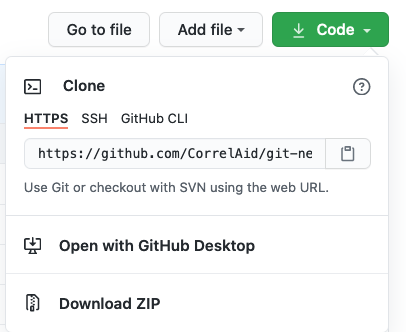
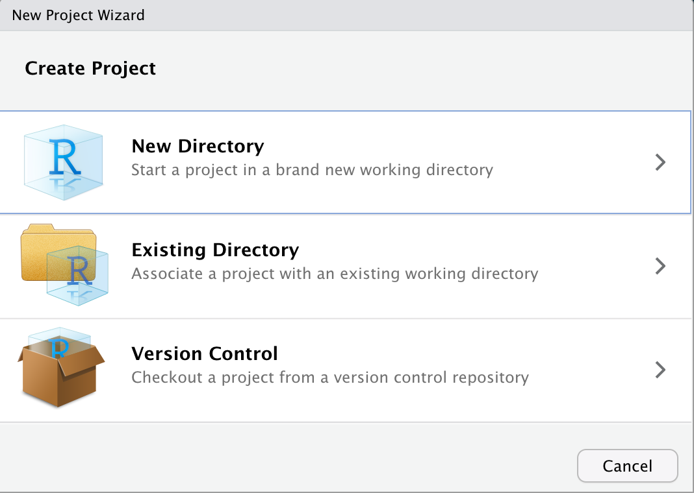
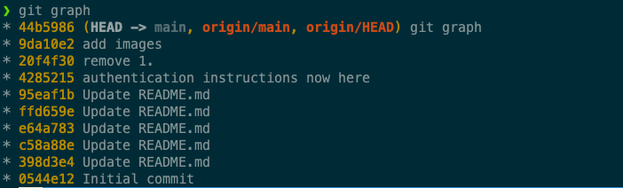
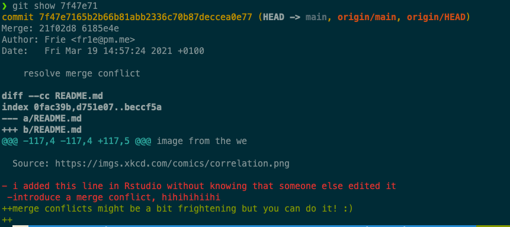
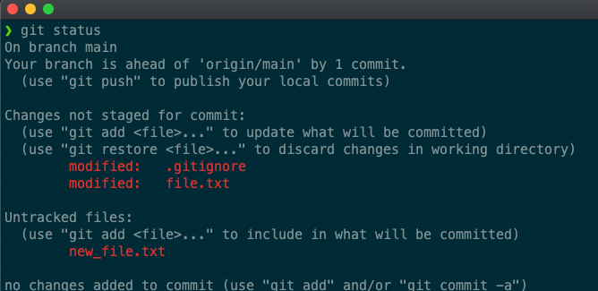
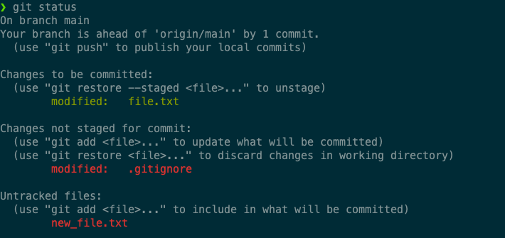
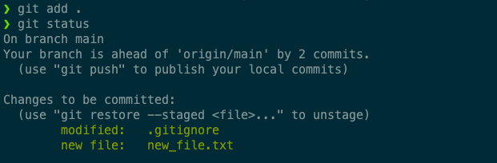
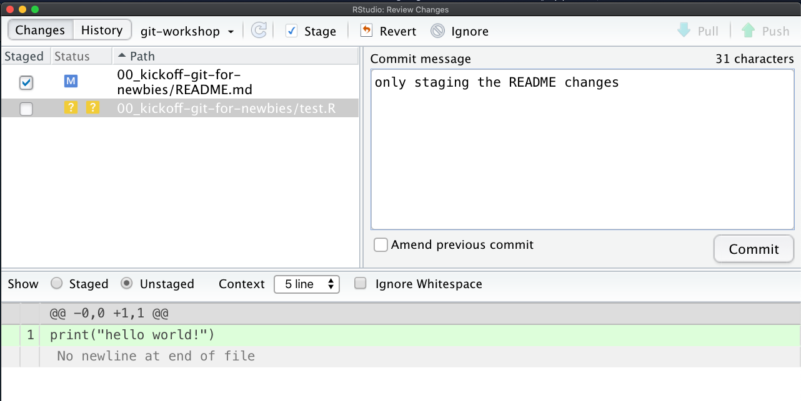
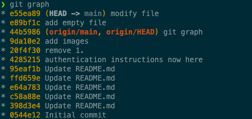
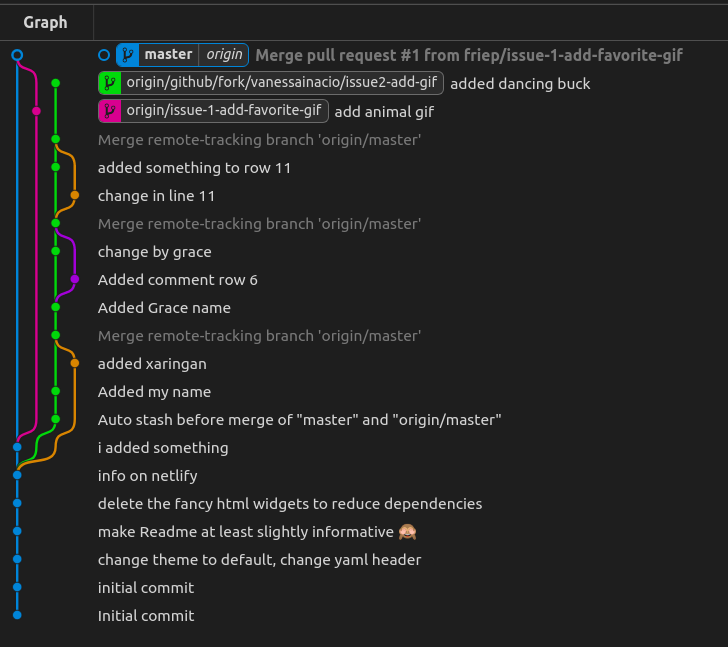

```{r setup, include=FALSE}
options(htmltools.dir.version = FALSE)
knitr::opts_chunk$set(
  fig.width=9, fig.height=3.5, fig.retina=3,
  out.width = "100%",
  cache = FALSE,
  echo = TRUE,
  message = FALSE, 
  warning = FALSE,
  fig.show = TRUE,
  hiline = TRUE
)
```

```{r xaringan-themer, include=FALSE, warning=FALSE}
library(xaringanthemer)
ca_blue <- "#3863a2"
ca_blue2 <- "#3c61aa"
ca_dark_blue <- "#2d3b5a"
ca_green <- "#96c342"
gray <- "#3c3c3b"
black <- "#000000"
style_duo_accent(
  primary_color = ca_blue,
  secondary_color = ca_green,
  header_color = ca_blue,
  text_color = gray,
  code_inline_color = colorspace::lighten(black),
  text_bold_color = colorspace::lighten(black),
  link_color = ca_blue,
  title_slide_text_color = "#FFFFFF",
  inverse_header_color = "#FFFFFF",
  text_font_size = "1.2rem",
  header_font_google = google_font("Roboto", "300"),
          text_font_google = google_font("Roboto"),
          code_font_google = google_font("Fira Mono")
)
```


## Who am I? 


- Frie Preu
- COO at CorrelAid (volunteer since 2015), before in IT consulting
- Add me:
    - LinkedIn: [Friedrike Preu](https://www.linkedin.com/in/friedrike-preu-a2bb46a7/)
    - Twitter: [@ameisen_strasse](https://twitter.com/ameisen_strasse)
    - GitHub: [friep](https://github.com/friep)
    - GitLab: [friep](https://gitlab.com/friep)

---

## Agenda

.pull-left[

- **Motivation**: Why Git?
- **Authentication**
- Forking and Cloning: **"Downloading" Repositories**
- Add and Commit: the **local workflow**
- Push and Pull: **"Uploading" and "Downloading" Commits**
- (Merge conflicts)
- (GitHub issues)
- (Working with branches)
]


.pull-right[
  
]


---
## Why Git?

.pull-left[

### 2014/15 - My BA
```bash
WS2014-15/BA/R
├── BA.R
├── Weighting.R
├── `droppedcode`.R
├── edvreg_Linzer-Lewis.R
├── edvreg_Linzer-Lewis_`modified`.R
├── edvreg_Linzer-Lewis_modified`1`.R
└── `final`models.R
```
]

.pull-right[

### 2017 - Hiwi job

```bash
hiwi/{prof}/eufunds/code/
├── data_wrangling.R
├── data_wrangling_nat.R
├── data_wrangling_`old`.R
├── map.R
├── maps`2`.R
└── plots.R
```

]

---

class: center, middle 


---

## Version Control to the Rescue!
- Example: [https://github.com/CorrelAid/git-newbie-playground](https://github.com/CorrelAid/git-newbie-playground)
- just a simple README.md for you 
- or: use the repository of your project

---
class: center, middle, inverse

# Requirements

---

## GitHub and Git
- Please see the [README](https://github.com/CorrelAid/git-newbie-playground) for the requirements
  - create GitHub account
  - install Git
  - introduce yourself to Git

---
class: center, middle, inverse

# Authentication

---


## Authentification 

**GitHub needs to know that you are you!**

.pull-left[
  ### HTTPS
  - with GitHub username + password -> easy to understand (not recommended anymore)
  - with GitHub username + Personal Access Token (PAT) -> recommended
  - store PAT in git credential store to avoid entering over and over 
  - clone `https://...` 
]
.pull-right[
 ### SSH
 - with a *keypair* (`id_rsa.pub` and `id_rsa`)
 - public key, private key cryptography (see e.g. [Youtube](https://www.youtube.com/watch?v=AQDCe585Lnc))
 - advantage: only set up once, no need to remember password
 - clone `ssh://...`
]

---

## Hands On: Authentication Setup

Go to https://github.com/CorrelAid/git-newbie-playground
and follow the instructions.

Scream if something does not work!

---

class: center, middle, inverse

# Download data - fork and clone

---

## Cloning a Repository 

### Repository
> A Git repository is a virtual storage of your project. It allows you to save versions of your code, which you can access when needed. ([Source](https://www.atlassian.com/git/tutorials/setting-up-a-repository))

--

`r emo::ji("bulb")` a repository can live at several places:
- **local** copy on your laptop
- on the **remote**: GitHub / GitLab

---

## Fork and Clone

### Fork
> A fork is a copy of a repository. Forking a repository allows you to freely experiment with changes without affecting the original project. ([Source](https://help.github.com/articles/fork-a-repo/))

### Clone 
> Cloning a repository syncs it to your local machine. After you clone, you can add and edit files and then push and pull updates.  ([Source](https://confluence.atlassian.com/bitbucket/clone-a-repository-223217891.html))

---

## Hands On 1 - clone a repository


### clone your project repository
- https://github.com/CorrelAid/{project-name}/
- check the slack channel of your project for the exact URL (it should be at the top in the "Topic" box)

### clone your own `git-tryout` repo
- see instructions here [https://github.com/CorrelAid/git-newbie-playground](https://github.com/CorrelAid/git-newbie-playground)

---

## Hands On 2 - clone a repo with the command line

.pull-left[
1. use `cd` in your terminal or Git bash to navigate to your target location (use the tab key for autocompletion)
2. `git clone https://github.com/{username}/git-newbie-playground` or the URL of your project repository 

]

.pull-right[

 
]

---
## Hands On 2 - clone a repo with RStudio

.pull-left[
1. In the top right corner,  click on the dropdown and choose New project
2. Select "Version Control"
3. Follow the dialogue
]

.pull-right[


]

---

class: center, middle, inverse


# The Local Workflow - Add und Commit 

---
## Commit

### Commit 
> A commit is the Git equivalent of a "save".[...] Git committing is an operation that acts upon a collection of files and directories. ([Source](https://www.atlassian.com/git/tutorials/saving-changes))

--> Commit = a "save point" in Git. 

---

## Commit

- a commit stores **a full snapshot** of the current state of the repository
- to the user, it is shown as so-called "diffs", i.e. what has changed since the last commit
  - edits of file(s)
  - creation of new file(s)
  - deletion of file(s)
  - renaming of file(s)

--> making a commit = taking a snapshot 
---

## Git history

git stores a history of snapshots / commits in its graph. 

```bash
git graph
```



---
## Git history - Show a commit

the "letter `r emo::ji("salad")`" is the short version of the so called "SHA hash" or "commit hash" -> it comes from "hashing" the snapshot the commit represents. 

We can have a look at a commit using `git show {hash}`


---
## Hands On 2: Investigate the commit history

Investigate the commits made so far in your repository. How many are there? Who has made them? What changes did they introduce?

.pull-left[
### Command line
- use `git graph` and `git show` as described in the slides before
- if you want to "break out" of a `git show` or `git graph` display which is too long, you can
  - hit enter until it ends
  - hit q 
  - hit ctrl+c

]
.pull-right[
### RStudio
- open the Git pane (next to "Environment", "History", etc.)
- click on the small clock icon `r emo::ji("clock")` to open the history
- close the extra window once you have investigated enough
]
---

class: center

## Making a commit involves 2 steps


(Source: [https://git-scm.com/about/staging-area](https://git-scm.com/about/staging-area))

**The "repository" is stored in the `.git` folder in your your project folder**

---

## Making a commit - Adding

In the staging area, you **draft** your commit and choose which of your changes you want to "save" in Git


**see what you have changed** `r emo::ji("eyes")`

```bash
git status
```

```bash
git diff
git diff --staged
```

**add individual files or folders**

```bash
git add {path}
```

or everything

```bash
git add .
```

---
## Making a commit - Adding



We add `file.txt` to our "commit draft": 

```bash
git add file.txt
```

---
## Making a commit - Adding
`.gitignore` and `new_file.txt` will not be part of the commit:


---
### Making a commit - Commit

Now, we can commit (`-m ""` adds the commit message):
```bash
git commit -m "change file.txt"
```

---

## Making a commit - Shortcuts

We can add all changes with: 

```
git add .
```



... or even commit all our changes directly without `git add`:

```bash
git commit -a -m 'directly committing all changes'
```

it's tempting but use both with care!

---
## Making a commit in RStudio

.pull-left[
- Git pane, then "Commit" button -> extra window opens
- `git add`: tick checkboxes
- `git commit`: commit message in box, then press commit
]
.pull-right[
```{r, echo=FALSE, out.width="100%"}

```
]
---

class: center, middle, inverse

# Detour: Markdown

---

## Markdown
- a markup language
- easy way to write...
  - notes 
  - texts
  - presentations
  - ...
- and *render* them to good looking documents!
- In R: RMarkdown 
---

## Markdown syntax
- `#(###)`: make a header
- `*` or `-`: make bullet point lists
- `[click here](https://git-scm.com/docs/)`: add a link
- ... many more, see [https://www.markdownguide.org/basic-syntax/](https://www.markdownguide.org/basic-syntax/)

---


## Hands On 3 - make a commit
.pull-left[
### command line
1. Change the `README.md` somewhere and create a new file `test.py` with a simple print statement
2. commit only the new file, not your changes to the README
3. Run `git graph` to see your commit
]
.pull-right[
### RStudio
1. Change the `README.md` somewhere and create a new file `test.R` with a simple print statement
2. commit only the new file, not your changes to the README
- go to the Git Pane 
]


---
class: center, middle


## Git quizzed!


---
class: center, middle

## Git quizzed!


---
class: center, middle, inverse

# Sync files - Push and Pull

---


## Git  Hosting

- GitHub: `r icons::fontawesome("github")` 
- GitLab: `r icons::fontawesome("gitlab")` 
- Keybase: `r icons::fontawesome("keybase")` 

---

## Git local and git remote

... what? 

- **local**: your laptop / machine
- **remote**: in the Cloud (GitLab, GitHub...) - you typically only have one remote ("origin")

```bash
$ git remote -v
origin	https://github.com/CorrelAid/git-newbie-playground.git (fetch)
origin	https://github.com/CorrelAid/git-newbie-playground.git (push)
```


---


## Sync: Git Pull and Git Push

- Git Pull: "download" new commits from GitHub
- Git Push: "upload" the commits you made locally to GitHub
---
## Sync: Git Pull and Git Push

"Download" from GitHub

```bash
git pull
```

"Upload" to GitHub

```bash
git push
```

---
## Pull and Push - RStudio

- Git pane / Git commit window
- button down (blue): pull
- buttom up (green): push


---
class: center, middle

# Hands On: Push!


---
## Pull, Commit, Push Workflow
1. Run `pull` before you resume your work to get the updates from your team mates that they have uploaded 
2. `commit` whenever you feel like you have achieved something or you want to "save" some intermediate code snippets (commit often!)
3. `push` every other commit
---
class: center, middle

## Git quizzed!


---


## Git quizzed!


---
class: center, middle, inverse

# When things go wrong...

---
class: center, middle


---
class: center, middle


https://xkcd.com/1597/ 

---

## When things go wrong...

1. as long nothing is pushed, all is (kind of) ok -> don't push if things are messed up!
2. if things are really messed up: save your code somewhere else and clone again

---

## Merge conflicts

> Merge conflicts occur when competing changes are made to the same line of a file, or when one person edits a file and another person deletes the same file. ([Source](https://help.github.com/en/articles/resolving-a-merge-conflict-using-the-command-line))

---

## Merge conflicts
1. you commit changes 
--

2. you pull to get the newest updates
--

3. your coworker has changed something that clashes with your changes
--

4. git: 


---
class: middle, center


---
## Solving merge conflicts

- **you** need to solve merge conflicts on your machine -> decide which version / changes you keep
- options:
  - edit files manually and look out for *conflict markers* (explanation [here](https://docs.github.com/en/github/collaborating-with-issues-and-pull-requests/resolving-a-merge-conflict-using-the-command-line#competing-line-change-merge-conflicts))
  - use a merge conflict tool in the command line (`git mergetool --tool-help`)
  - VSCode has an integrated [merge conflict tool](https://www.youtube.com/watch?v=kBIMGOxqqnk) which is very nice 
  - other Git GUIs also might have one
  - RStudio does not have a merge conflict tool :( -> have to resolve manually
```
<<<<<<< HEAD
i added this line in Rstudio without knowing that someone else edited it
=======
introduce a merge conflict, hihihihiihi
>>>>>>> 6185e4e97db38d774fdcd2e41a31788362856d51
```

`r emo::ji("warning")`: a file can have **multiple** conflicts!
---
## Solving merge conflicts

```
<<<<<<< HEAD
i added this line in Rstudio without knowing that someone else edited it
=======
introduce a merge conflict, hihihihiihi
>>>>>>> 6185e4e97db38d774fdcd2e41a31788362856d51
```

- `<<<<<<<`: my current changes (HEAD)
- `=======`: seperates my changes from the "incoming" changes
- `>>>>>>>`: end of "incoming" changes, shows the commit hash or the branch name (more on this later)

my new version:
```md
merge conflicts might be a bit frightening but you can do it! :) 
```

**save, add, and commit!**


---

## Hands On: Merge conflicts

1. edit `README.md` **on GitHub** in a certain line
2. edit `README.md` locally on your machine **in the same line** (edit it differently!)
3. commit your own changes (don't push yet!)
4. `pull` 
5. solve the merge conflict locally and push your own version. `r emo::ji("devil")`


---
class: center, middle, inverse

# Work with GitHub

---
class: center, middle, inverse

# Issues

---

## Issues


- issues: todos / bugs / ideas
- each issue has a number 
- \#issueno in commit message associates commit with issue

- example: [https://github.com/CorrelAid/hugo-website/issues](https://github.com/CorrelAid/hugo-website/issues) 

---

## Hands On: Issues


1. create an issue "add a GIF" 
2. go to [giphy.com](giphy.com), find a funny gif and add it to the README  (-> copy link)
3. add + commit. link the issue number in the commit message (#issueno)
4. push
5. reload the issue page (ctrl + r) 

---

## Recap issues

- very useful for project organization 
- discussion is centralized (**but**: don't put sensitive information in GitHub)
- Tip: create a GitHub *board* for process tracking


---
class: center, inverse, middle 

# Branches and Merge Requests

---
class: center, middle




---
class: center, middle


---


## Branches

### Branch
> A branch represents an independent line of development. Branches serve as an abstraction for the edit/stage/commit process. You can think of them as a way to request a brand new working directory, staging area, and project history. ([Source](https://www.atlassian.com/git/tutorials/using-branches))


### Checkout

> The git checkout command lets you navigate between the branches created by git branch. Checking out a branch updates the files in the working directory to match the version stored in that branch, and it tells Git to record all new commits on that branch. Think of it as a way to select which line of development you’re working on. ([Source](https://www.atlassian.com/git/tutorials/using-branches/git-checkout))

---

## Why branches?

- stability: only have working code on "main" branch 
  - e.g. CI/CD directly to dev
  - users download your code from GitHub / GitHub (e.g. `devtools::install_github()`)
--

- collaboration: independent development of code ("feature branches") 
--

- experiments: try it out in a branch
--

- example: [https://github.com/jandix/sealr/branches](https://github.com/jandix/sealr/branches)

---

## Branches Workflow

1. create a branch in Git with a meaningful name (e.g. issue1-add-favorite-gif)
```
git switch -c "#1-add-favorite-gif" # or git checkout -b "#1-add-favorite-gif"
```
--

2. checkout branch: branch is automatically checked out (check with `git graph`: `HEAD` points to `#1-add-favorite-gif`)

--

3. continue working as usual (pull-commit-push cycles)
--

4. (optional): merge other branches into your branch to get their updates: `git merge {branch_name}`

--

5. merge your branch into the main branch (checkout main, then see 4.)


`r emo::ji("white_check_mark")`  You can always switch between branches using `git checkout`


---

## Pull Requests (PRs)

> Pull requests let you tell others about changes you've pushed to a branch in a repository on GitHub. Once a pull request is opened, you can discuss and review the potential changes with collaborators and add follow-up commits before your changes are merged into the base branch.
 ([Source](https://docs.github.com/en/github/collaborating-with-issues-and-pull-requests/about-pull-requests))


- useful "review" and feedback functionality 
- [GitHub Hello World](https://guides.github.com/activities/hello-world/#pr)
---

## Hands On - branches and PRs

1. create a new issue (think of something!)
2. create a branch called `issue2-{description}` locally
3. work on issue 2
4. push the branch 
5. open a pull request 
6. merge the PR
---

## Real life: Branches and Pull Requests 
- branches
  - very useful when developing R packages / applications / shiny apps in a team: feature branches
  - relevance for data analysis projects: enables working in parallel on several methods, keep main clean of non-working code, backup (!)
- merge requests
  - centralize discussion
  - code review stage


---

class: center, middle, inverse
# Miscellaneous

---

## Git stash

> git stash temporarily shelves (or stashes) changes you've made to your working copy so you can work on something else, and then come back and re-apply them later on. Stashing is handy if you need to quickly switch context and work on something else, but you're mid-way through a code change and aren't quite ready to commit. ([Source](https://www.atlassian.com/git/tutorials/saving-changes/git-stash))

---
class: center

## Git stash


- put it away for now!
- useful for (temporarily) storing stuff not ready to commit 

---

# Recap

---

## What we learned today

- Fork and clone a GitHub repository
--

- make a commit in the command line
--

- pull and push commits from / to GitHub
--
- solve merge conflicts

--
- work with issues, branches and merge requests 

---
class: middle, center, inverse

# That's it! 

---

## If you ever need help...contact me!

### Frie Preu
 + `r icons::fontawesome("briefcase")` data scientist / IT consultant @ [codecentric AG](https://www.codecentric.de)
 + `r icons::fontawesome("github")` [friep](https://github.com/friep)
 + `r icons::fontawesome("gitlab")` [friep](https://gitlab.com/friep)
 + `r icons::fontawesome("keybase")` [friep](https://keybase.io/friep)
 + `r icons::fontawesome("twitter")` [ameisen_strasse](https://twitter.com/ameisen_strasse)
 + `r icons::fontawesome("slack")` [RLadies Slack](https://rladies-community-slack.herokuapp.com/)

### Resources
Check the README of the git-newbie-playground repo for some more resources!